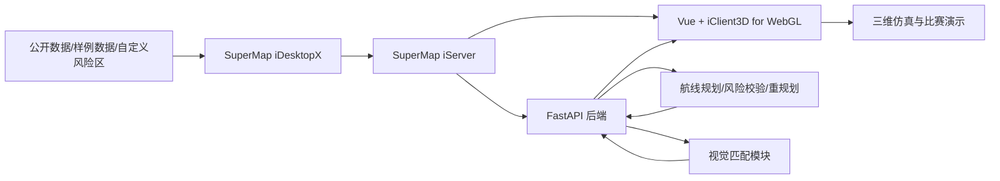

# 项目总控执行计划

## 1. 项目目标

构建一个基于 SuperMap GIS 底座的低空任务智能规划与三维仿真系统，完成以下可演示闭环：

1. 加载 SuperMap 三维任务区域。
2. 展示地形、影像、风险区、障碍物等 GIS 数据。
3. 输入起点、终点和任务约束。
4. 自动生成多种候选航线。
5. 对航线进行风险校验和评分。
6. 播放三维仿真过程。
7. 中途加入临时风险区并触发动态重规划。
8. 展示视觉匹配候选区域与置信度。
9. 生成任务报告和比赛演示材料。

## 2. 项目边界

### 当前范围

- 使用 SuperMap iDesktopX 制作任务区域数据和三维场景。
- 使用 SuperMap iServer 发布地图、三维、数据和空间分析服务。
- 使用 Vue 3 + iClient3D for WebGL 构建三维 Web 平台。
- 使用 FastAPI 提供任务、航线、风险校验、视觉匹配和仿真接口。
- 使用 A* 作为主航线规划算法。
- 使用预计算或轻量化视觉匹配结果支撑演示。

### 不做范围

- 不接真实无人机飞控。
- 不生成真实飞控执行指令。
- 不做武器控制、打击任务或实飞决策。
- 不把视觉匹配承诺为真实实时定位系统。

## 3. 总体架构

## 4. 阶段里程碑

| 阶段 | 时间建议 | 目标 | 主要交付 |
|---|---|---|---|
| M1 环境与底座 | 第 1 周 | SuperMap 环境和数据服务跑通 | iDesktopX 场景、iServer 服务、服务截图 |
| M2 平台骨架 | 第 2 周 | 前后端项目可运行 | Vue 页面、FastAPI 接口、任务/图层/航线 mock |
| M3 航线与风险 | 第 3 周 | 实现自动规划和风险评分 | 三类航线、风险航段、高程剖面 |
| M4 动态仿真 | 第 4 周 | 完成飞行回放和重规划 | 时间轴、事件日志、临时风险区、重规划 |
| M5 视觉匹配 | 第 5 周 | 完成视觉候选区域展示 | 图片输入、候选区域、置信度、匹配点 |
| M6 材料收口 | 第 6 周 | 完整 demo 和提交材料 | PPT、部署文档、演示视频、系统说明 |

## 5. 工作流

### 状态日志

项目推进状态以 `12_project_status_log.md` 为准。任何新对话、新成员接手、阶段复盘或任务验收前，都应先阅读该日志，再查看任务看板。

日志必须记录：

- 当前状态快照。
- 里程碑状态。
- 当前阻塞。
- 关键决策。
- 阶段性推进记录。
- 下一步建议。

### 每日推进

- 每人每天更新 `08_task_board.md` 中任务状态。
- 有阻塞超过半天，立即标记 `Blocked` 并写明需要谁配合。
- 所有跨模块变更先同步接口文档，再写代码。

### 每周例会

1. 对照里程碑检查已完成内容。
2. 演示本周可运行成果。
3. 关闭已验收任务。
4. 明确下周必须完成的 3 到 5 个关键任务。

### 阶段验收

- 每个里程碑必须有截图、录屏或可运行页面。
- 算法功能必须有输入样例、输出结果和异常处理。
- 演示相关功能优先于完美工程化。

## 6. 关键依赖顺序

1. GIS 数据和 iServer 服务先行。
2. 前端先接 mock 数据，再接后端真实接口。
3. 后端先做任务/航线数据结构，再挂接算法。
4. 航线规划先用简化栅格数据跑通，再引入真实风险区和高程。
5. 视觉匹配先做预计算演示，再升级模型推理。

## 7. 项目成功标准

- 在一台演示电脑上可以完整启动并完成演示流程。
- 三维场景中能看到任务区、风险区、航线、动态重规划结果。
- 系统能解释为什么推荐某条航线，为什么触发风险告警。
- 材料中能清楚说明 SuperMap 在项目中的作用。
- 答辩时可以稳定演示，不依赖临时手工操作补救。
