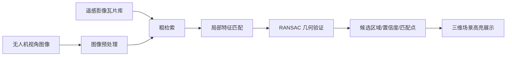

# 分工细化：视觉匹配模块

## 1. 角色目标

实现视觉地理配准辅助演示：输入无人机视角图像，输出候选地理区域、置信度、匹配点数量和偏移估计，并在三维场景中展示。

## 2. 模块定位

本模块用于仿真验证和任务辅助分析，不输出真实飞控控制指令，不承诺真实无人机实时定位。

## 3. 实施策略

优先采用“预计算 + 可解释展示”路线，保证比赛演示稳定：

1. 准备固定任务区域影像。
2. 切分候选瓦片。
3. 准备 3 到 5 张无人机视角示例图。
4. 离线计算或人工整理匹配结果。
5. 前端演示时通过接口返回稳定结果。
6. 时间允许再接入 DINOv2、LoFTR 或 LightGlue。

当前工程框架详见 `docs/vision_matching_framework.md`。该文档记录了后端接口、demo 数据结构、前端展示要求和后续真实算法接入点。

## 4. 推荐算法流程



## 5. 数据准备

| 数据 | 说明 |
|---|---|
| query_image | 无人机视角图像或模拟视角图 |
| tile_images | 遥感影像候选瓦片 |
| tile_index | 瓦片编号、中心点、边界、多边形 |
| match_result | 候选区域、置信度、匹配点、偏移估计 |

## 6. 输出结构

```json
{
  "match_id": "match_demo_001",
  "query_image": "demo_uav_001.jpg",
  "candidates": [
    {
      "tile_id": "tile_034",
      "confidence": 0.87,
      "matched_points": 142,
      "bbox": [[116.1, 39.1], [116.2, 39.1], [116.2, 39.2], [116.1, 39.2]],
      "center": [116.15, 39.15, 120],
      "offset_m": [12.5, -8.2],
      "status": "best"
    }
  ]
}
```

## 7. 执行步骤

### 第 1 步：演示数据

- 选定 3 到 5 张输入图片。
- 为每张图片准备 3 个候选区域。
- 每个候选区域准备置信度和匹配点数量。

### 第 2 步：结果接口

- 后端提供 `POST /api/vision/match`。
- 输入图片编号或文件。
- 返回候选区域列表。

### 第 3 步：前端展示

- 小窗显示输入图像。
- 地图上高亮候选区域。
- 右侧显示置信度排序。
- 最优候选区域使用醒目颜色。

### 第 4 步：算法增强

- 粗检索：DINOv2 或轻量特征向量。
- 局部匹配：LoFTR 或 LightGlue。
- 几何验证：OpenCV RANSAC。

## 8. 验收标准

- 固定输入图片可以稳定返回匹配结果。
- 三维场景能高亮候选地理区域。
- 结果包含置信度、匹配点数量、偏移估计。
- 答辩时能说明该模块是视觉定位辅助，不是飞控控制。

## 9. 当前仓库落点

| 类型 | 路径 | 说明 |
|---|---|---|
| 文档 | `docs/vision_matching_framework.md` | 视觉匹配需求与框架设计 |
| 接口 | `backend/app/api/vision.py` | 图片清单、瓦片索引、匹配执行、结果查询 |
| 服务 | `backend/app/services/vision_service.py` | 预计算结果读取和候选排序 |
| 数据 | `demo_data/task_demo.json` | 3 张样例图、5 个瓦片、3 组匹配结果 |
| 前端 | `frontend/src/App.vue` | 视觉样例选择、候选区域高亮、候选详情展示 |
